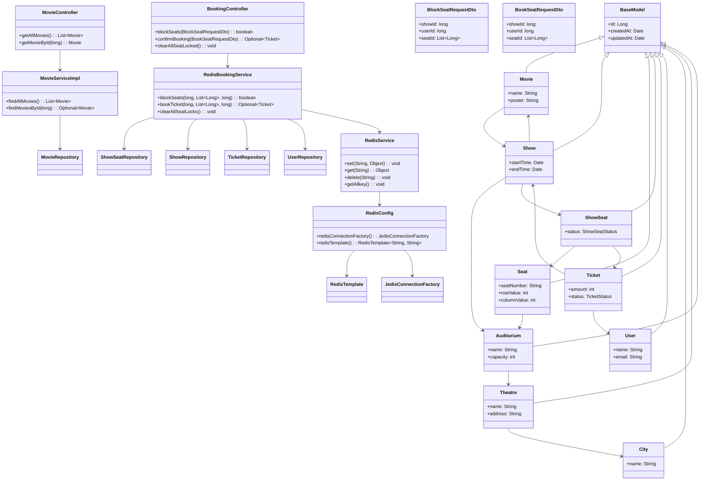

# BMS (Booking Management System)

## Overview

This project is a Spring Boot-based movie booking system built with:
- Java 17
- Spring Boot 4.0.5
- Spring Data JPA (MySQL)
- Spring Data Redis
- Jedis client
- Lombok

The app exposes REST APIs to manage movies and seat booking.

## Architecture summary

The application is built in layers:

- `controllers` — REST API entry points for movies and booking actions
- `services` — business logic and orchestration for booking and movie retrieval
- `repositories` — Spring Data JPA persistence for domain entities
- `configuration` — Redis connection and infrastructure beans
- `models` — JPA entities and enums for the booking domain
- `dto` — request payload objects for booking actions

## Component interactions

- `MovieController` serves movie read endpoints and delegates to `MovieService`
- `BookingController` handles seat block, booking confirmation, and stale-lock cleanup via `BookingService`
- `MovieServiceImpl` retrieves movies from `MovieRepository`
- `RedisBookingService` implements booking flow and uses `CacheService` plus multiple repositories
- `RedisService` performs Redis-based seat lock reads and writes
- `RedisConfig` builds Redis connection and template beans from environment variables

## UML class diagram



## Notes

- `RedisBookingService.clearAllSeatLocks()` is currently empty and should be implemented to remove stale seat lock keys.
- `MovieController.getMovieById()` returns `null` when a movie is not found; consider returning a proper 404 response.
- `ShowSeatRepository.bookShowSeatsBulk()` uses a JPQL update setting `status = 1`, which relies on the enum ordinal mapping for `ShowSeatStatus.BOOKED`.

## Recommended improvements

1. Add error handling and proper HTTP responses for missing movies or invalid booking requests
2. Implement `BookingService.clearAllSeatLocks()` to clean Redis locks
3. Consider returning `ResponseEntity` in controllers for clearer status codes
4. Add logging and validation to the booking flow
5. Add API documentation (Swagger/OpenAPI)

## How to Run

Set these environment variables:

- `MYSQL_URL`
- `MYSQL_USERNAME`
- `MYSQL_PASSWORD`
- `REDIS_HOST`
- `REDIS_PORT`
- `REDIS_USERNAME`
- `REDIS_PASSWORD`

Then run:

```bash
./mvnw spring-boot:run
```


The core domain entities are:

- `Movie`
- `Show`
- `Theatre`
- `Auditorium`
- `City`
- `Seat`
- `ShowSeat`
- `Ticket`
- `User`

All entities extend `BaseModel`, which provides:

- `Id`
- `createdAt`
- `updatedAt`

### Relationships

- `Movie` 1..* `Show`
- `Show` 1..* `ShowSeat`
- `Show` -> `Auditorium`
- `ShowSeat` -> `Seat`
- `Seat` -> `Auditorium`
- `Auditorium` -> `Theatre`
- `Theatre` -> `City`
- `Ticket` -> `User`
- `Ticket` -> `Show`
- `Ticket` 1..* `ShowSeat`

### Enums

- `SeatType` — NORMAL, PREMIUM, VIP, RECLINER
- `ShowSeatStatus` — AVAILABLE, BOOKED, BLOCKED, LOCKED
- `TicketStatus` — BOOKED, CANCELLED, PENDING

## Booking Flow

1. `BookingController.blockSeats()` receives a `BlockSeatRequestDto`.
2. `RedisBookingService.blockSeats()` checks booking state in the `ShowSeatRepository` and Redis.
3. Seats are reserved by writing a lock key into Redis.
4. `BookingController.confirmBooking()` receives a `BookSeatRequestDto`.
5. `RedisBookingService.bookTicket()` verifies the lock keys exist.
6. A `Ticket` is created and `ShowSeatRepository.bookShowSeatsBulk()` updates seat rows in the database.

## How to Run

Set the following environment variables:

- `MYSQL_URL`
- `MYSQL_USERNAME`
- `MYSQL_PASSWORD`
- `REDIS_HOST`
- `REDIS_PORT`
- `REDIS_USERNAME`
- `REDIS_PASSWORD`

Then run:

```bash
./mvnw spring-boot:run
```

## Notes and Suggestions

- `RedisBookingService.clearAllSeatLocks()` is currently empty and should be implemented to remove stale locks.
- `MovieController.getMovieById()` returns `null` when a movie is not found; consider returning 404.
- `ShowSeatRepository.bookShowSeatsBulk()` uses JPQL to set `status = 1`, which corresponds to the `BOOKED` enum ordinal.

## Files Added

- `README.md`
- `architecture.puml`
