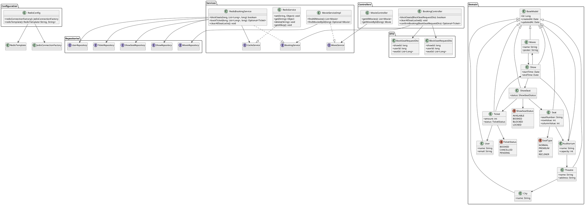

# BMS (Booking Management System)

## Overview

This project is a Spring Boot-based movie booking system built with:
- Java 17
- Spring Boot 4.0.5
- Spring Data JPA (MySQL)
- Spring Data Redis
- Jedis client
- Lombok

The app exposes REST APIs to manage movies and seat booking.

## Architecture

The project is organized into the following layers:

- `controllers` — REST endpoints for booking and movie lookup
- `services` — business logic and reusable abstractions
- `repositories` — JPA data access interfaces
- `models` — JPA entities and enums for the domain model
- `configuration` — Redis connection setup
- `dto` — request payload objects

A class diagram describing the architecture is available in `architecture.puml`.

## Architecture Diagram

The architecture is rendered below in a UML-style layout. The diagram shows application layers, core entities, and dependencies.

```text
Controllers
  MovieController --> MovieServiceImpl --> MovieRepository
  BookingController --> RedisBookingService --> {ShowSeatRepository, ShowRepository, TicketRepository, UserRepository, CacheService}

Services
  MovieServiceImpl ..|> MovieService
  RedisBookingService ..|> BookingService
  RedisService ..|> CacheService

Configuration
  RedisConfig --> RedisTemplate
  RedisConfig --> JedisConnectionFactory

Domain
  Movie --> Show --> ShowSeat --> {Seat, Ticket}
  Ticket --> User
  Show --> Auditorium --> Theatre --> City
  Seat --> Auditorium
  ShowSeat --> ShowSeatStatus
  Ticket --> TicketStatus
  Seat --> SeatType
```



### Controllers

- `MovieController`
  - `GET /api/v1/movies`
  - `GET /api/v1/movies/{id}`
  - Delegates to `MovieService`

- `BookingController`
  - `POST /api/v1/booking/block`
  - `POST /api/v1/booking/confirm`
  - `DELETE /api/v1/booking`
  - Delegates to `BookingService`

### Services

- `MovieServiceImpl`
  - Implements `MovieService`
  - Uses `MovieRepository`

- `RedisBookingService`
  - Implements `BookingService`
  - Uses `CacheService`, `ShowSeatRepository`, `ShowRepository`, `TicketRepository`, `UserRepository`
  - Blocks seats in Redis and confirms bookings using a transactional bulk update

- `RedisService`
  - Implements `CacheService`
  - Uses Spring Redis template to store and read seat locks

### Configuration

- `RedisConfig`
  - Provides Redis connection factory and `RedisTemplate<String, String>` beans
  - Reads configuration from environment variables

## Domain Model

The core domain entities are:

- `Movie`
- `Show`
- `Theatre`
- `Auditorium`
- `City`
- `Seat`
- `ShowSeat`
- `Ticket`
- `User`

All entities extend `BaseModel`, which provides:

- `Id`
- `createdAt`
- `updatedAt`

### Relationships

- `Movie` 1..* `Show`
- `Show` 1..* `ShowSeat`
- `Show` -> `Auditorium`
- `ShowSeat` -> `Seat`
- `Seat` -> `Auditorium`
- `Auditorium` -> `Theatre`
- `Theatre` -> `City`
- `Ticket` -> `User`
- `Ticket` -> `Show`
- `Ticket` 1..* `ShowSeat`

### Enums

- `SeatType` — NORMAL, PREMIUM, VIP, RECLINER
- `ShowSeatStatus` — AVAILABLE, BOOKED, BLOCKED, LOCKED
- `TicketStatus` — BOOKED, CANCELLED, PENDING

## Booking Flow

1. `BookingController.blockSeats()` receives a `BlockSeatRequestDto`.
2. `RedisBookingService.blockSeats()` checks booking state in the `ShowSeatRepository` and Redis.
3. Seats are reserved by writing a lock key into Redis.
4. `BookingController.confirmBooking()` receives a `BookSeatRequestDto`.
5. `RedisBookingService.bookTicket()` verifies the lock keys exist.
6. A `Ticket` is created and `ShowSeatRepository.bookShowSeatsBulk()` updates seat rows in the database.

## How to Run

Set the following environment variables:

- `MYSQL_URL`
- `MYSQL_USERNAME`
- `MYSQL_PASSWORD`
- `REDIS_HOST`
- `REDIS_PORT`
- `REDIS_USERNAME`
- `REDIS_PASSWORD`

Then run:

```bash
./mvnw spring-boot:run
```

## Notes and Suggestions

- `RedisBookingService.clearAllSeatLocks()` is currently empty and should be implemented to remove stale locks.
- `MovieController.getMovieById()` returns `null` when a movie is not found; consider returning 404.
- `ShowSeatRepository.bookShowSeatsBulk()` uses JPQL to set `status = 1`, which corresponds to the `BOOKED` enum ordinal.

## Files Added

- `README.md`
- `architecture.puml`
